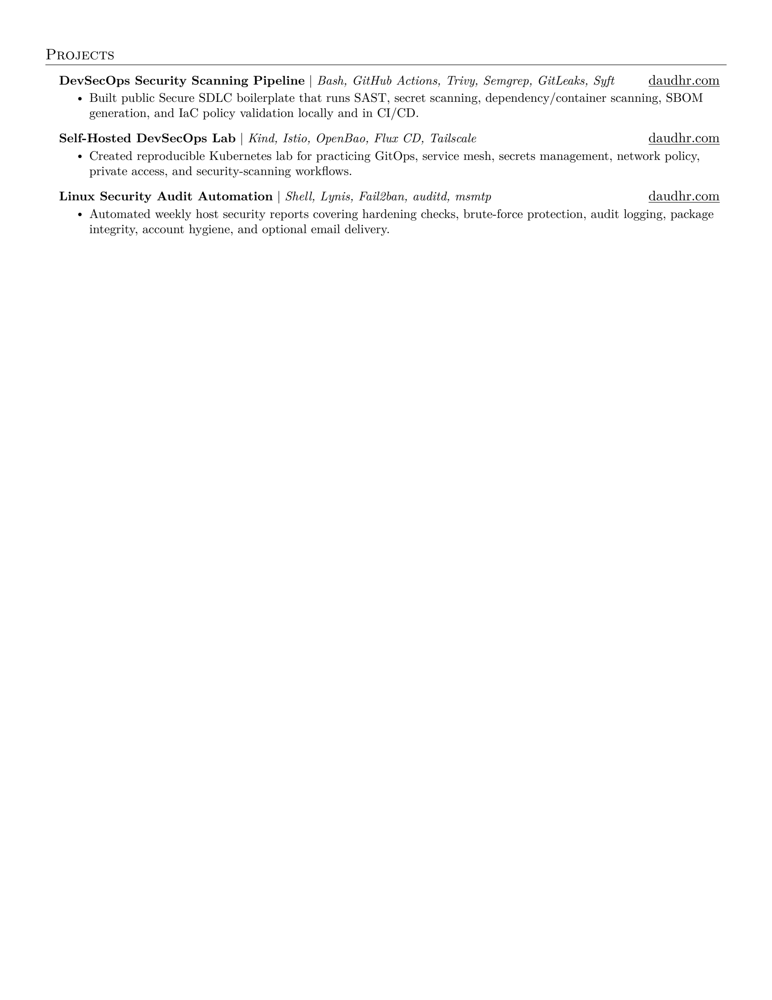

# Daud Hidayat Ramadhan — CV

**DevSecOps & Backend Engineer | Secure SDLC | CI/CD Security | Go | Kubernetes**

This repository contains my professional CV, built with LaTeX and aligned with my personal portfolio at **[daudhr.com](https://daudhr.com)**.




---

## Files

| File | Description |
|---|---|
| `daud-cv.tex` | LaTeX source file — edit this for CV content changes |
| `daud-cv.pdf` | Compiled PDF — use this for job applications and recruiter submissions |
| `daud-cv-1.png` | PNG preview of page 1 |
| `daud-cv-2.png` | PNG preview of page 2 |
| `daud-cv-preview.png` | Preview image for sharing or repository display |
| `build.sh` | Local compilation script |
| `Dockerfile` | Alpine-based LaTeX Docker image for compilation |

---

## Build

### Local LaTeX

If `pdflatex` is installed:

```bash
./build.sh
```

Or run manually:

```bash
pdflatex -interaction=nonstopmode daud-cv.tex
pdflatex -interaction=nonstopmode daud-cv.tex
```

### Docker

```bash
docker build -t latex .
docker run --rm -v "$PWD":/data latex -interaction=nonstopmode daud-cv.tex
```

### PNG Preview

Generate PNG previews from the compiled PDF:

```bash
python3 -m pip install --user pypdfium2 pillow
python3 - <<'PY'
import pypdfium2 as pdfium

pdf = pdfium.PdfDocument('daud-cv.pdf')
for index in range(len(pdf)):
    image = pdf[index].render(scale=3, rotation=0).to_pil()
    image.save(f'daud-cv-{index + 1}.png')

pdf[0].render(scale=3, rotation=0).to_pil().save('daud-cv-preview.png')
PY
```

### Overleaf

Upload `daud-cv.tex` to [overleaf.com](https://www.overleaf.com) and click **Recompile**.

---

## About This CV

- **Identity:** DevSecOps & Backend Engineer focused on Secure SDLC, CI/CD security, and secure backend systems
- **Experience:** Security Engineer at BSI UII, previously Software Developer intern
- **Education:** Universitas Islam Indonesia — Bachelor of Informatics, GPA 3.70/4.00
- **Certifications:** IDCamp 2024 DevOps Engineer Expert, Bangkit Academy 2024 Cloud Computing, Google IT Support Professional Certificate
- **Portfolio Website:** [daudhr.com](https://daudhr.com)

---

## License

The LaTeX template is licensed under the MIT License. See [LICENSE](LICENSE) for details.

My CV content, experience descriptions, project details, and personal branding are my own work.
