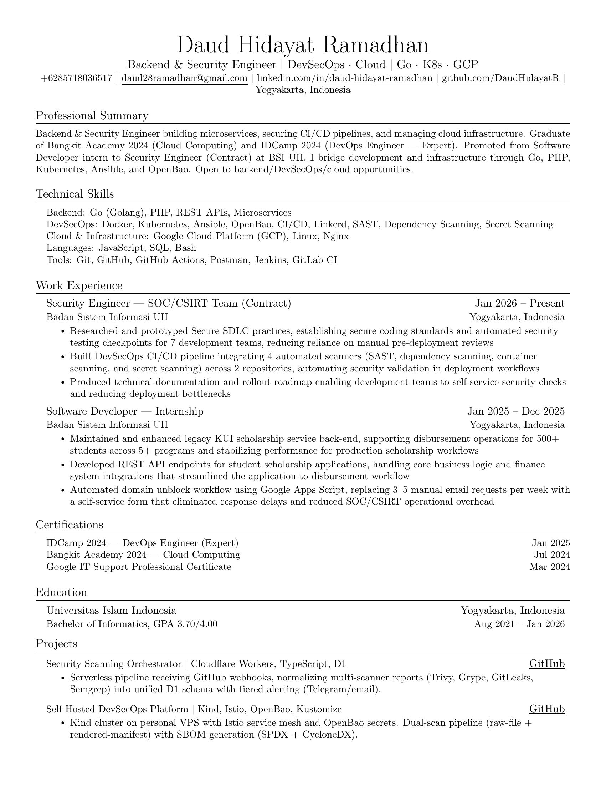

# Daud Hidayat Ramadhan — CV

This repository contains my professional CV (resume).



## Files

| File | Description |
|---|---|
| `daud-cv.tex` | LaTeX source file — edit this for changes |
| `daud-cv.pdf` | Compiled PDF — submit this to recruiters |
| `daud-cv-1.png` | PNG preview of the CV |
| `build.sh` | Local compilation script |
| `Dockerfile` | Alpine-based LaTeX Docker image for compilation |
| `jakes-resume-template.tex` | Original Jake's Resume template (reference) |

## Compile

### Local (with lualatex installed)

```bash
lualatex -interaction=nonstopmode daud-cv.tex
lualatex -interaction=nonstopmode daud-cv.tex
```

### Docker

```bash
docker build -t latex .
docker run --rm -v "$PWD":/data latex lualatex -interaction=nonstopmode daud-cv.tex
```

### Overleaf

Upload `daud-cv.tex` to [overleaf.com](https://www.overleaf.com) and click **Recompile**.

## About

- **Identity:** Backend & Security Engineer with DevSecOps and Cloud focus
- **Experience:** Security Engineer at BSI UII, previously Software Developer intern
- **Education:** Universitas Islam Indonesia — Bachelor of Informatics (GPA 3.70/4.00)
- **Certifications:** IDCamp 2024 (Expert), Bangkit Academy 2024 (Cloud Computing), Google IT Support

## License

The LaTeX template is licensed under the MIT License. See [LICENSE](LICENSE) for details.

My CV content (text, experience descriptions, project details) is my own work.
